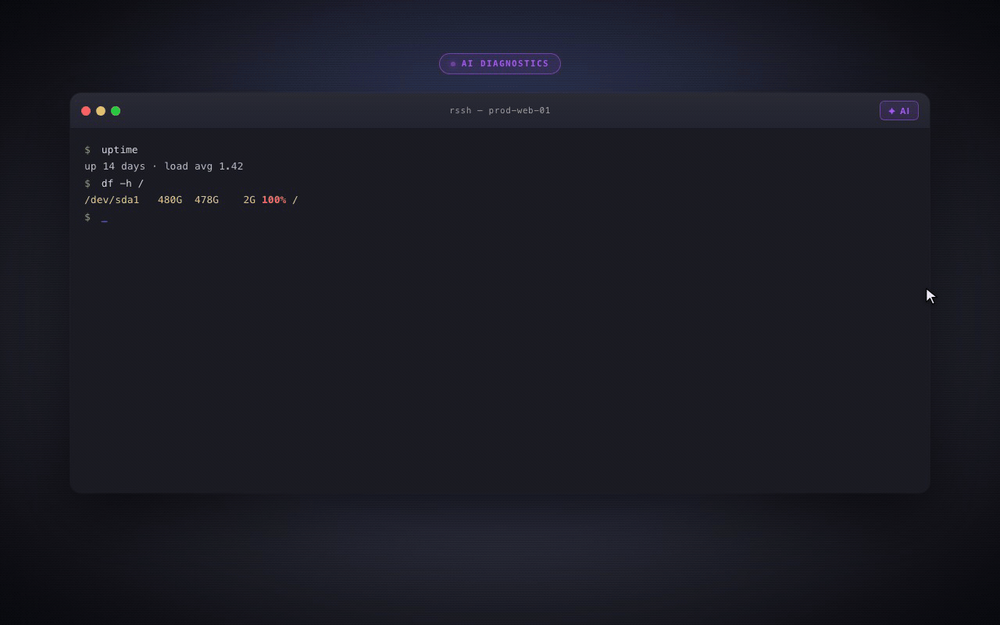
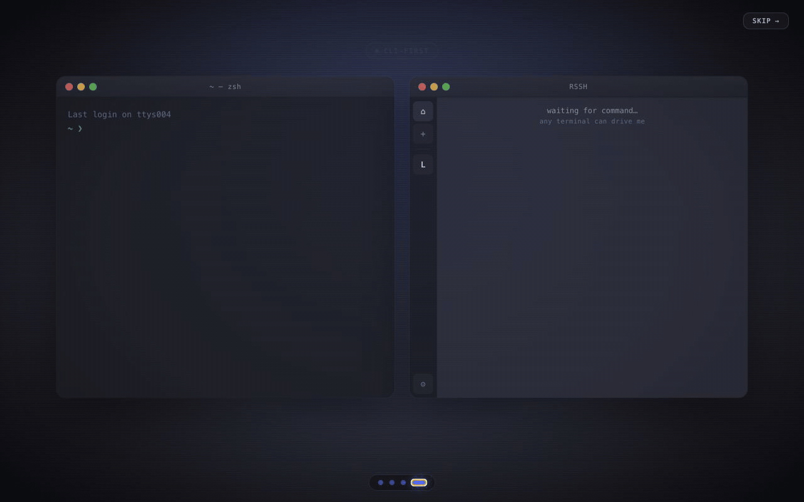
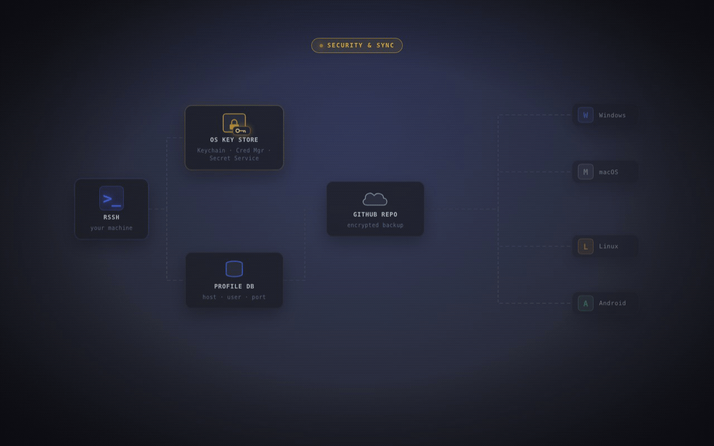

# RSSH — An SSH Client Born to be an AI Ops Assistant

I can't stand the SSH clients on the market anymore. Every tool wants to grab a piece of my home, take a piss without flushing.

- They maintain their own host keys — I really don't get why?
- Cloud sync requires a paid subscription. Somewhat understandable, but I'm not in the habit of paying.
- Their own proprietary recording format — why?
- Multi-platform without a mobile version.

rssh is designed the other way around: blend into your existing Unix toolchain as much as possible.


---

## 1. Born to Be an AI Ops Assistant

- Server environment initialization — still installing it yourself?
- High CPU/MEM? Still opening an AI Chat web page and acting as a manual courier between command input and output?
- Troubleshooting bugs — still reading logs by yourself?

An SSH client is a born ops tool. Every command's input/output passes through it. The RSSH GUI exposes multiple tools for the LLM to call, giving the LLM hands and feet.

Skills live in `src-tauri/src/ai/prompts`, audits welcome.

Of course, security is paramount. Every action by the LLM must go through tools provided by RSSH, and every action passes through RSSH's shape validator + your authorization.



## 2. The rssh CLI

The `rssh` CLI is a special creature. You can use rssh data inside any terminal tool, do `rssh open [profile]` anytime anywhere, and it reads **the same** SQLite (`~/.rssh/rssh.db`) as the GUI. A profile added in the GUI is immediately usable from the command line; vice versa.

```
rssh                       # list all profiles
rssh ls prod               # fuzzy search
rssh open gateway-01       # connect directly
rssh open fwd my-tunnel    # start a named port forward
rssh add profile           # interactive create
```

This means you can drop `rssh open foo` into any script, alias, or Makefile, with no need to maintain a duplicate SSH config.



---

## 3. Zero Remote-Config Command Block Stripes

Scrolling back a screen of output in the terminal, finding where the previous command started — that's an old problem.

Warp is a great tool that solves this beautifully, but it **requires you to modify the shell integration scripts on the server**.

rssh is **fully implemented on the front end**, with zero server changes:

- Each command draws a vertical color bar on the left; input and output share the same color.
- The next command rotates color automatically — a golden-angle HSL algorithm guarantees maximum contrast between adjacent colors.
- When entering full-screen programs like vim/top/less, the bar fades to a translucent gray and stays out of the way.
- One toggle in settings disables it.

**It doesn't know which machine you're on, and it doesn't need to know.** It works the moment you connect, including someone else's bastion host.


---

## 4. Security: rssh doesn't keep your secrets, but does multi-device sync

Most similar products' "sync" feature essentially uploads your keys to their servers, and then promises you "end-to-end encryption". The problem is: how do you verify it?

rssh handles it in three layers:

**1. Local secrets → System keychain**

Passwords and private-key passphrases all go through macOS Keychain / Windows Credential Manager / Linux Secret Service.

You trust your own keychain more than any third-party software — that assumption is reasonable.

**2. Remote private keys → not uploaded by default**

Each credential has its own "include in sync" toggle. Private keys rarely change anyway. Copy them between two devices once via USB stick, AirDrop, or `scp`, and use them for ten years. Pushing them to the cloud for "convenience" is trading security for laziness.

**3. Configuration data → encrypted, then dropped into your own private repo**

Profiles, forwarding rules, snippets — pure config data — are encrypted and pushed to **your own private GitHub repo**. Not rssh's servers — rssh has no servers.

The encryption itself is no magic: salted SHA-256 derived key (1000 rounds) + streaming XOR + HMAC-SHA256 authentication.

The code is in `src-tauri/src/crypto.rs`, a hundred lines you can finish reading. Audit welcome.

```
rssh config set     # configure token and repo
rssh config push    # push
rssh config pull    # pull
```

Underneath it's just base64 + GitHub API. **Switch tools whenever you want — your data is in your repo.** No lock-in, no subscription, no "Export to CSV" button.



---

## 5. Sharing `~/.ssh/known_hosts` with ssh

This is the most fundamental philosophical difference between rssh and other GUI clients.

Most SSH GUI clients (Termius, Tabby…) maintain their own host key database. The result: hosts you've trusted via `ssh` on the command line have to be re-confirmed in the GUI; fingerprints you've removed in the GUI are still in the command line.

rssh reads and writes the standard `~/.ssh/known_hosts` file directly. Entries removed by `ssh-keygen -R <host>` are immediately known to rssh; hosts newly trusted in rssh are immediately usable by ssh.

---

## 6. Other Out-of-the-Box Capabilities

Not given top billing, but each one pulls its weight:

- asciicast v2: a generic `NDJSON` format, not proprietary. That means any session you record can be `asciinema upload`-ed, embedded in a web page, or consumed by any asciinema tool.
- Keyword highlighting: custom rules, automatic coloring for ERROR / WARN / INFO, 14 presets.
- SFTP browsing: Cmd+O to summon, drag-and-drop upload/download.
- Command snippets: Cmd+S to summon a reusable command library.
- Port forwarding: local / remote, real-time traffic stats.
- Cross-platform: macOS (Intel + Apple Silicon), Windows, Linux (deb/rpm/AppImage), Android.

---

## Download

The [Releases](https://github.com/shihuili1218/rssh/releases) page provides macOS / Windows / Linux / Android installers.

MIT license. No login, no subscription, no ads, no telemetry toggle — because there's no telemetry at all.

This isn't a business model, it's an engineering default. An SSH client should be a program running on your machine, not a SaaS.

---

**Design philosophy in one line**: a tool should serve the way you already work, not force you to make way for the tool.
