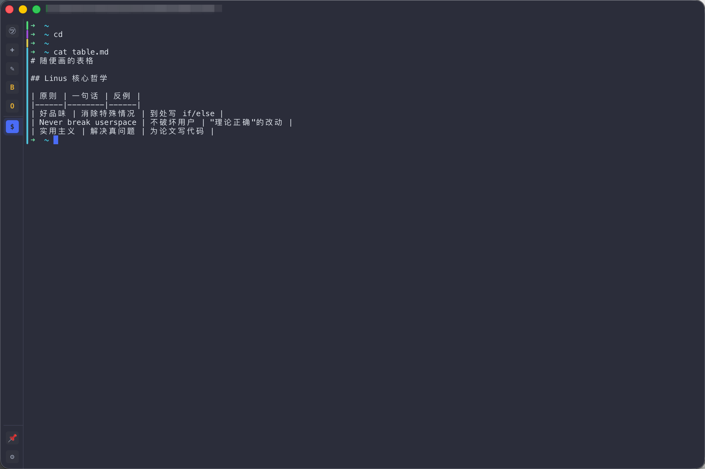
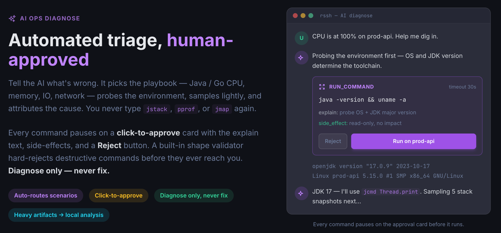

# SSH 客户端 RSSH —— 天生的 AI 运维助手

我受不了市面上 SSH 客户端了，所有工具都想来我家里抢地盘，撒泡尿还不冲

- 自己维护 host key，我真不懂为啥？
- 云同步订阅要收费，稍微能理解，但是我没有付费习惯
- 自己的专有录制格式，为啥呀？
- 多平台没有移动端

rssh 的设计反过来：尽可能融入你已有的 Unix 工具链。



---

## 一、天生的 AI 运维助手

- 服务器环境初始化，还在自己安装？
- CPU/MEM 过高？还在打开AI Chat网页，但命令输入输出的搬运工？
- 排查bug，还在自己看日志？

SSH 客户端是天生的运维工具，所有命令输入/输出都就经过它。RSSH GUI 提供了多个工具供 LLM 调用，为 LLM 提供了手和脚。

skills 在 src-tauri/src/ai/prompts ，欢迎审查。

当然安全是无比重要的，LLM 的任何操作都必须通过 RSSH 提供的工具，而所有操作都会在 RSSH 层 shape validator + 你的授权。



## 二、rssh CLI
`rssh` CLI是一个特殊的存在，你可以在任意终端工具里使用rssh的数据，随时随地rssh open [profile]，并且它和 GUI **读同一个** SQLite（~/.rssh/rssh.db）。在 GUI 里加的 Profile，命令行立刻能用；反之亦然。

```
rssh                       # 列出所有 profile
rssh ls prod               # 模糊搜索
rssh open gateway-01       # 直接连
rssh open fwd my-tunnel    # 启动一个命名端口转发
rssh add profile           # 交互式创建
```

这意味着你可以把 `rssh open foo` 塞进任何脚本、alias、Makefile，不需要再维护一份重复的 SSH 配置。

---

## 三、零远端配置的 Command Block 色条

终端里翻一屏输出，找上一条命令的起点是个老问题。

Warp 是一个很好的工具，这个问题它解决得漂亮，但它**要求你在服务器上改 shell 集成脚本**。

rssh **完全前端实现**，零服务器改动：

- 每条命令在左侧画一道竖向色条，输入和输出共享同色
- 下一条命令自动换色——黄金角 HSL 算法保证相邻颜色对比最大
- 进入 vim/top/less 这类全屏程序时，色条淡出为半透明灰，不打扰
- 设置里一键关掉

**它不知道你在哪台机器上，也不需要知道。** 一次连接立刻生效，包括别人的堡垒机。

---

## 四、安全：rssh 不替你保管秘密，但实现了多端同步

绝大多数同类产品的"同步"功能，本质上是把你的密钥上传到它们的服务器，然后向你保证"端到端加密"。问题是：你怎么验证？

rssh 的处理方式分三层：

**1. 本地密钥 → 系统钥匙串**

密码、私钥的 passphrase，全部走 macOS Keychain / Windows Credential Manager / Linux Secret Service。

你信任你自己的钥匙串，胜过信任任何第三方软件——这个假设是合理的。

**2. 远端私钥 → 默认不上传**

每条凭据有独立的"是否参与同步"开关。私钥这种东西本就极少变更，用 U 盘、AirDrop、`scp` 在两台设备之间拷一次，用十年。把它推到云上换"方便"，是用安全换懒惰。

**3. 配置数据 → 加密后塞进你自己的私有仓库**

profile、转发规则、片段这些纯配置数据，加密后推到**你自己的 GitHub 私有仓库**。不是 rssh 的服务器——rssh 没有服务器。

加密本身没有魔法：salted SHA-256 派生密钥（1000 轮）+ 流式异或 + HMAC-SHA256 认证。

代码在 `src-tauri/src/crypto.rs`，一百行能读完，欢迎审计。

```
rssh config set     # 配置 token 和仓库
rssh config push    # 推送
rssh config pull    # 拉取
```

底层就是 base64 + GitHub API。**想换工具就换，数据就在你的 repo 里。**没有锁定，没有订阅，没有"导出到 CSV"按钮。

---

## 五、和 ssh 共享 ~/.ssh/known_hosts

这是 rssh 和其他 GUI 客户端最根本的哲学差异。

大部分 SSH GUI 客户端（Termius、Tabby…）自己维护一套 host key 数据库。结果是：你在命令行用 ssh 信任过的主机，换到 GUI 里再认一次；GUI 里删掉的指纹，命令行里还在。

rssh 直接读写标准的 `~/.ssh/known_hosts` 文件。`ssh-keygen -R <host>` 删掉的条目 rssh 立刻知道；rssh 里新信任的主机，ssh 也立刻能连。

---

## 六、其他开箱即用的能力
不单列，但都实打实干活：

- asciicast v2：通用的`NDJSON`格式，不是专有格式。这意味着你录下来的任何一段会话，可以直接 asciinema upload、直接嵌到网页、直接被任何 asciinema 工具消费。
- 关键词高亮：自定义规则，ERROR / WARN / INFO 自动染色，14 种预设
- SFTP 浏览：Cmd+O 唤起，拖拽上传下载
- 命令片段：Cmd+S 唤起可复用命令库
- 端口转发：本地 / 远程，实时流量统计
- 跨全平台：macOS（Intel + Apple Silicon）、Windows、Linux（deb/rpm/AppImage）、Android

---

## 下载

[Releases](https://github.com/shihuili1218/rssh/releases) 页面提供 macOS / Windows / Linux / Android 安装包。

MIT 协议，无登录，无订阅，无广告，无遥测开关——因为压根没有遥测。

这不是商业模式，是工程默认值。SSH 客户端本来就该是一个跑在你机器上的程序，不该是一个 SaaS。

---

**设计哲学一句话**：工具要服务你已有的工作方式，而不是逼你为工具让步。
